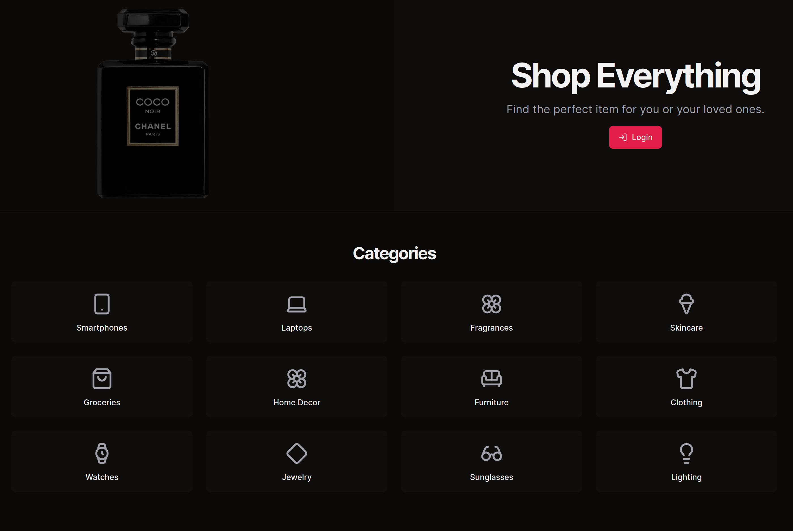
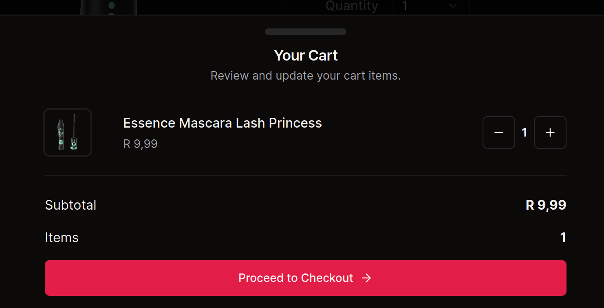
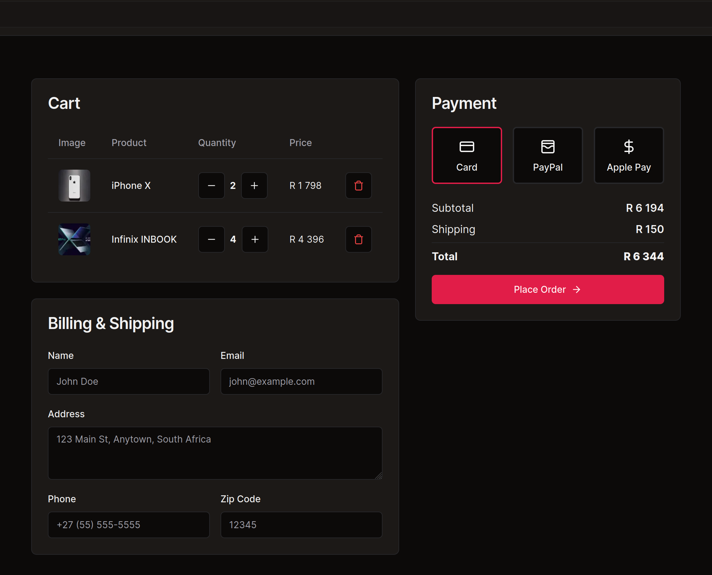
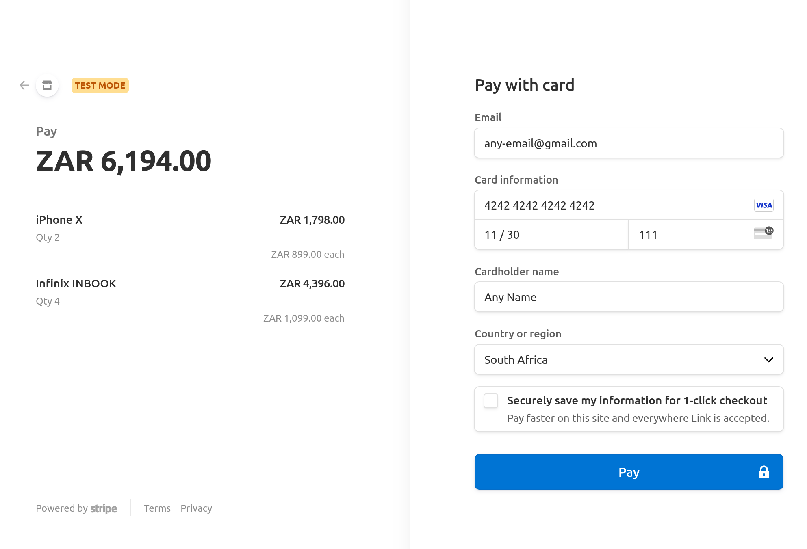
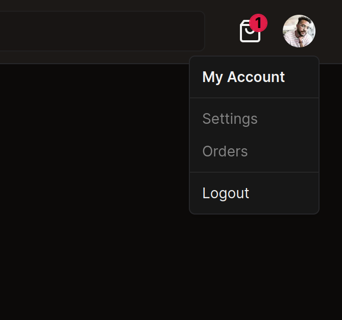

# Teeldinho Store

Teeldinho Store is an e-commerce minimum viable product (MVP) that showcases an online store's general functionality, utilizing modern technologies and best practices for authentication, product browsing, checkout, and payment.


## Project Overview

### Backend

- **DummyJSON**: Used as the backend for product data and related endpoints.
- **Iron Session**: A secure, stateless, and cookie-based session library used for handling authentication and maintaining user sessions.
- **Next.js 14 Server Actions**: Implemented for querying the database, interacting with external API and performing server-side operations.

### Frontend

- **Next.js 14 Server Components**: Employed to optimize server-side rendering and enhance performance.
- **Zustand**: Used for state management, with slices for modular and maintainable state handling.
- **Stripe**: Integrated for managing payments securely and efficiently.
- **Radix UI**: Used for UI components to ensure accessibility and high-quality user interfaces.
- **Tailwind CSS**: Applied for styling, providing a utility-first approach to design.
- **Lodash**: Leveraged for utility functions to simplify code and improve performance.

### Additional Packages

- **Class Variance Authority**: Used for handling variant-based styling.
- **Framer Motion**: Utilized for animations and enhancing user experience.
- **Lucide React**: Included for icon components.
- **React Hook Form**: Applied for form handling and validation.
- **Zod Schema Validator**: Provides robust type safety and data validation across server actions and client forms, ensuring data integrity and enhancing TypeScript integration.
- **Sonner**: Used for toast notifications.

## Key Features

- **Authentication**: Users can log in to access their accounts and perform actions.
- **Product Viewing**: Users can browse products, view details of a specific product, and manage their cart.
- **Checkout and Payment**: Users can proceed to checkout and make payments through Stripe.
- **State Management**: Zustand is used for managing cart state, ensuring smooth and efficient state updates.
- **Middleware**: Next.js middleware is implemented to ensure only authenticated users can perform certain actions and access certain routes.
- **Next Safe Actions**: Ensures type-safe server actions with robust input validation and error handling, enhancing state management and overall application stability.

## Areas of Improvement

- **Optimistic Updates**: Incorporating optimistic updates to provide a smoother user experience.
- **Search and Filter Functionality**: Enabling users to search and filter products easily.
- **Account and Order Management**: Implementing features for users to manage their accounts and view order history.
- **Pagination**: Improving pagination for better data management and user experience.

## Getting Started

1. **Install dependencies**:

   ```sh
   npm install

   ```

2. **Start the development server:**:

   ```sh
   npm run dev

   ```

3. **Build for production:**:

   ```sh
   npm run build

   ```

4. **Start the production server:**:
   ```sh
   npm start
   ```

## Environment Variables

Ensure you have the following environment variables set in your .env.local file:

```sh
NEXT_PUBLIC_API_BASE_URL='https://dummyjson.com'
NEXT_PUBLIC_IMAGE_HOSTNAME='cdn.dummyjson.com'
SESSION_PASSWORD='some-32-characters-password'
NEXT_PUBLIC_CORRECT_USERNAME='get-username-from-dummyjson.com'
NEXT_PUBLIC_CORRECT_PASSWORD='get-password-from-dummyjson.com'
NEXT_PUBLIC_STRIPE_PUBLIC_KEY='some-long-stripe-public-key'
STRIPE_SECRET_KEY='some-long-stripe-secret-key'
NEXT_PUBLIC_DOMAIN='http://localhost:3000'
```

## Testing Stripe Payments

To test the Stripe payment integration, you can use the following test card information provided by Stripe. This will allow you to simulate successful payments and see how the application handles them without using real credit card details.

### Test Card Information

- **Card Number**: 4242 4242 4242 4242
- **Expiration Date**: Any future date (e.g., 12/34)
- **CVC**: Any 3-digit number (e.g., 123)
- **ZIP Code**: Any valid ZIP code (e.g., 12345)

### Steps to Test Payments

1. **Add Items to Cart**: Browse the shop and add items to your cart as usual.
2. **Proceed to Checkout**: Go to the checkout page and enter the test card details.
3. **Complete the Payment**: Use the test card information provided above to complete the payment.
4. **Verify Success**: Upon successful payment, you should be redirected to the success page, and the cart should be cleared.

### Important Notes

- **No Real Transactions**: Using the test card number will not create real transactions or charges.
- **Testing Scenarios**: You can test various scenarios, such as successful payments, declined payments, and more, using different test card numbers provided by Stripe. Refer to the [Stripe Testing Documentation](https://stripe.com/docs/testing) for more test card numbers and scenarios.

By using the test card information, you can thoroughly test the payment process and ensure everything works as expected before going live with real transactions.

## Screenshots












